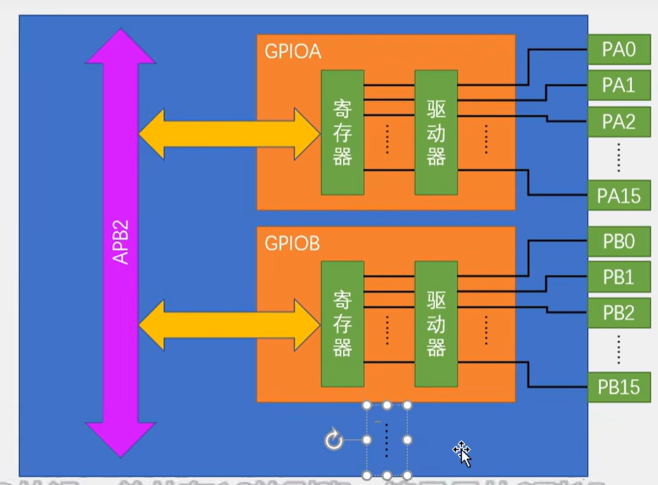
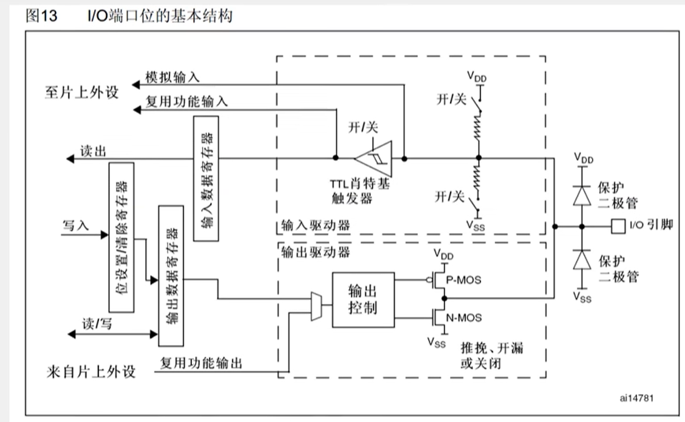
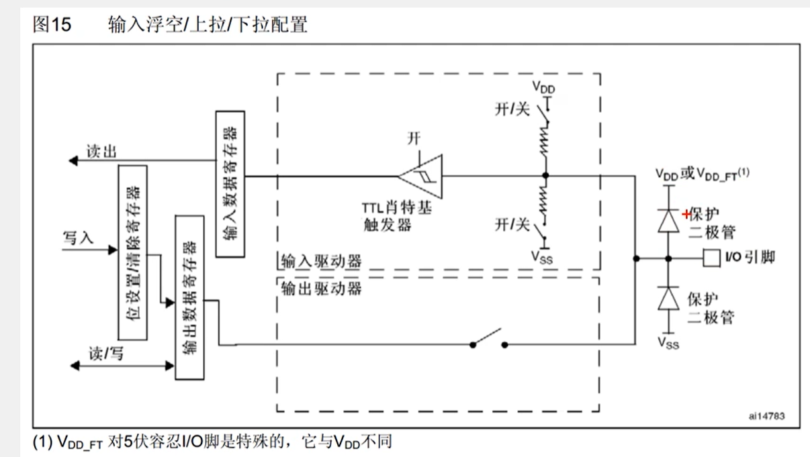
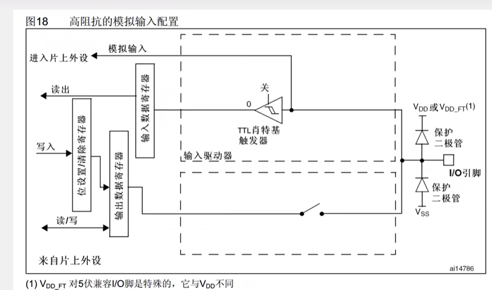
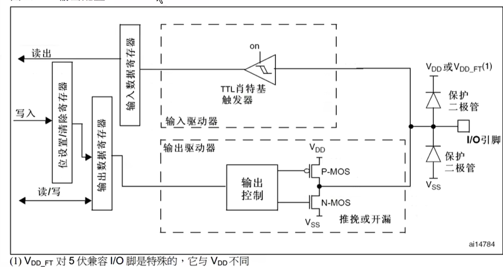
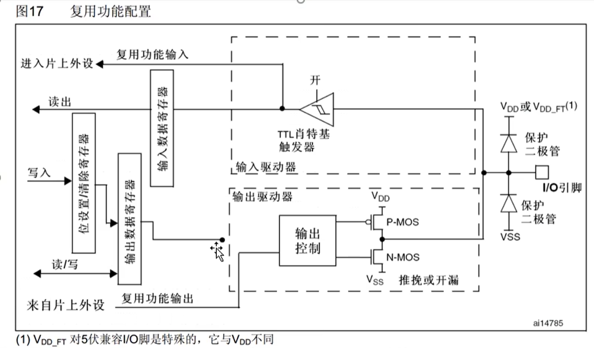
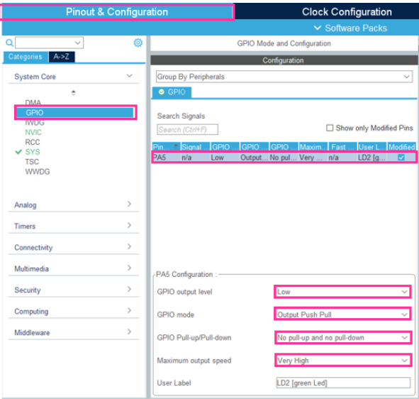

# Whitestar000的GPIO学习笔记

> 预备资源：
>
> * [x] 江协科技 《STM32入门教程》 第3章
>   * 公认STM32最佳入门课
> * [x] ST Wiki 《Getting started with GPIO》
>   * 官方文档补充
> * [x] 百度、CSDN 《我所有看不懂的名词》

***

## GPIO 是什么?

* GPIO（General Purpose Input Output），通用输入输出口，俗称I/O口。它是一种集成电路引脚，不具有特定功能。与大多数引脚专门用于向某一部件发送信号不同，GPIO引脚的功能可由软件自定义并加以控制。

* GPIO可配置为八种输入输出模式，引脚电平为0~3.3V，部分引脚可容忍至5V。

  > 容忍指的是可以输入到5V，但无论如何都无法输出到5V
  >
  > 在STM32的定义中，带有FT标注的就是可以容忍到5V的

* 输出模式下，GPIO可以控制端口输出高低电平，用于驱动LED、控制蜂鸣器、模拟通信协议输出时序等。

  > GPIO最多只能输出3.3V的电压，如果控制功率较大的元件，需要加入驱动电路。 

* 输入模式下，GPIO可以读取端口的高低电平或电压，用于读取按键输入、外接模块的电平信号输入、ADC电压采集、模拟通信协议接收数据等。

  > **电平**[^1]
  >
  > 电平是一个工程术语，通常指信号幅度或功率的相对大小，也可以指电路中某点的电压值或电压状态。
  >
  > 在数字电路中，高电平和低电平是数字电路中用于表示**逻辑状态**的电信号：
  >
  > * 高电平（High Level）：通常表示逻辑 1，是一个较高的电压值。在大多数数字电路中，高电平的电压接近电源电压（如3.3V或5V）。
  >
  > * 低电平（Low Level）：通常表示逻辑 0，是一个较低的电压值。在大多数数字电路中，低电平接近0V（接地）。
  >
  > **在GPIO中的应用**
  >
  > * 高电平：当GPIO引脚输出高电平时，引脚电压接近电源电压（如3.3V或5V），可以用来驱动负载（如点亮LED）。
  > * 低电平：当GPIO引脚输出低电平时，引脚电压接近0V，通常用于关闭负载或拉低信号。
## GPIO的基本结构

  

  * 每个GPIO外设有16个引脚，记为0~15

  * 寄存器保存配置位与输出数据，并据此驱动引脚。

    > 查阅STM32F10xxx参考手册8.2获取寄存器相关参数表格

  * 驱动器用于增大驱动能力

## GPIO的位结构



* 保护二极管，限制电压，避免过高或过低电压导致伤害元件

* VDD上拉电阻，VSS下拉电阻，用于配置输入模式，给输入提供一个默认的输入电平。

* 施密特触发器，对输入电压进行整形，高于上限时输出立即变成高电平，低于下限时输出立即变为低电平。

  > 只有在限定方向上跨越上下限时改变，其他情况是不会变的。

  > 江协老师说图片上这里是一个翻译错误，应该是施密特触发器。

* 模拟输入，连接ADC[^2]，提供模拟量。

* 复用功能输入，连接到其他需要读取端口的外设，提供数据量。

  > | 类型           | **信号特征**                                                 | **硬件电路**                                                 | **软件处理**                                                 | **精度与分辨率**                                             | **抗干扰能力**                                       |
  > | -------------- | ------------------------------------------------------------ | ------------------------------------------------------------ | ------------------------------------------------------------ | ------------------------------------------------------------ | ---------------------------------------------------- |
  > | **模拟量输入** | **连续变化**的电压、电流或电阻值，能够反映物理量的细微变化。 | 需要**模数转换器（ADC）**将模拟信号转换为数字值。需**滤波电路**抑制噪声（如RC滤波）。 | 需校准和**线性化**处理（如传感器非线性补偿）。               | 受**ADC位数**限制（如12位ADC的分辨率为1/4096）。             | **弱**：易受噪声、温漂、线路阻抗影响，导致信号失真。 |
  > | **数字量输入** | **离散状态**，通常表现为高/低电平（如0V和5V）、脉冲或数字编码。 | 直接读取高低电平，可能需**施密特触发器**消除抖动。需上拉/下拉电阻确定**默认状态**。 | 直接判断**逻辑状态**（0或1），或解析**数字协议**（如CAN报文） | 通常为**二进制判断**（0或1），高精度需求需额外协议（如PWM占空比测量） | **强**：高低电平范围明确，噪声容限高。               |
  >
  > 模拟量与数据量[^3]

* 输出数据寄存器，普通的I/O口输出，通过写数据寄存器的某一位操作对应的端口。

* 位设置/清除寄存器，用于单独操作输出数据寄存器中的某一位，不影响其他位。

* MOS管，电子开关，选择输出方式。

  > 查阅STM32F10xxx参考手册8.1.11获取外设的GPIO配置表格

## GPIO的模式

| 模式             | 性质     | 电路            | 特征                                                  |
| ---------------- | -------- | --------------- | ----------------------------------------------------- |
| **浮空输入**     | 数字输入 | VDD/VSS全断     | 读取引脚电平，若引脚悬空，电平不确定。                |
| **上拉输入**     | 数字输入 | 接通VDD         | 读取引脚电平，若引脚悬空，默认高电平。                |
| **下拉输入**     | 数字输入 | 接通VSS         | 读取引脚电平，若引脚悬空，默认低电平。                |
| **模拟输入**     | 模拟输入 | GPIO整体关闭    | GPIO无效，引脚直接接入ADC                             |
| **开漏输出**     | 数字输出 | P-MOS无效       | 输出引脚电平，高电平为高阻态，无驱动力，低电平接VSS   |
| **推挽输出**     | 数字输出 | 两个MOS管均有效 | 输出引脚电平，高电平接VDD，低电平接VSS                |
| **复用开漏输出** | 数字输出 | P-MOS无效       | 由片上外设控制，高电平为高阻态，无驱动力，低电平接VSS |
| **复用推挽输出** | 数字输出 | 两个MOS管均有效 | 由片上外设控制，高电平接VDD，低电平接VSS              |



> 输入模式下，输出部分整体断开，无法执行输出。



> 模拟输入下，GPIO所有的通路全部关闭，由引脚直接接入ADC。



> 在输出模式下，输入也是有效的。
>
> 一个端口可以有多个输入，但只能有一个输出。



> 通用输出没有连接，普通的输入是有效的。

## GPIO的库函数

> 库函数，顾名思义，已经存储在库中的函数。
>
> 选定代码后，右键跳转，可以查看库中的用法说明，直接复制粘贴即可。

> 说明：在学习代码时我习惯开着编译器学习，下面的有一些代码是我直接把我在编译器里写的东西和注释一起复制过来的。所有的内容也可以直接在我提交的代码中找到。

1. 初始化一个引脚

   ```c
   /*Configure GPIO pin : LED_Pin */
   GPIO_InitStruct.Pin = LED_Pin;//在这里选择你的引脚，因为我进行了重命名，这里的引脚很好看。
   GPIO_InitStruct.Mode = GPIO_MODE_OUTPUT_PP;//这是GPIO的工作模式选择的推挽输出（Push-Pull Output）模式。
   GPIO_InitStruct.Pull = GPIO_NOPULL;//上拉/下拉电阻：NOPULL = 不启用内部上拉/下拉。
   GPIO_InitStruct.Speed = GPIO_SPEED_FREQ_LOW;//输出速度
   HAL_GPIO_Init(LED_GPIO_Port, &GPIO_InitStruct);//结构体地址
   //这里就相当于是在给每个引脚创建一个“类”，如果是使用Cube Mx创建的项目，他会自动帮你写好代码，给你在Cube Mx中声明的引脚创建类
   ```

   > CubeMX中的设置：
   >
   > 
   >
   > 自上而下为：
   >
   > * 输出电平水平
   > * 工作模式
   > * 上拉/下拉电阻设置
   > * 输出速度
   > * 自命名引脚

2. 点灯

   ```c
   HAL_GPIO_TogglePin(LED_GPIO_Port, LED_Pin);
     HAL_Delay(250);//延时，这里的单位是毫秒，HAL_Delay 算的是"两次翻转之间的间隔"，一个完整闪烁周期需要两次 Toggle
   HAL_GPIO_TogglePin(LED_GPIO_Port, LED_Pin);
     HAL_Delay(500);//可以直接通过加上多个代码的方式控制小灯以不同的节奏闪烁
   HAL_GPIO_TogglePin(LED_GPIO_Port, LED_Pin);
     HAL_Delay(250);
   /*
    *TogglePin是切换引脚电平状态，即引脚电平状态在高电平和低电平之间切换，在需要改变引脚电平状态时使用，例如LED灯闪烁；
    *易混：WritePin是明确指定引脚输出高/低电平，例如上电时先把 LED 设成熄灭
    */
   ```

> 更多的功能，在需要使用的时候，可以直接上网搜索或在库中寻找相应的功能


[^1]:  版权声明：本文为CSDN博主「南山小乌贼」的原创文章，遵循CC 4.0 BY-SA版权协议，转载请附上原文出处链接及本声明。原文链接：https://blog.csdn.net/nanshanxiaowuzei/article/details/155606818
[^2]:对于GPIO来说，它只能读取引脚的高低电频，要么是高电平，要么是低电平，只有两个值，而使用了ADC之后，就可以对这个高电平和低电平之间的任意电压进行量化，最终用一个变量来表示
[^3]:版权声明：本文为CSDN博主「月生言己」的原创文章，遵循CC 4.0 BY-SA版权协议，转载请附上原文出处链接及本声明。原文链接：https://blog.csdn.net/cabbage_hhh/article/details/147337914
